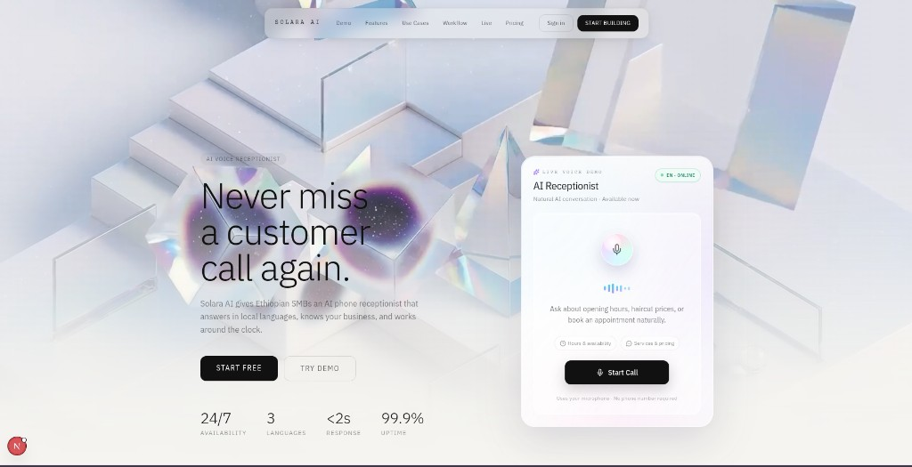
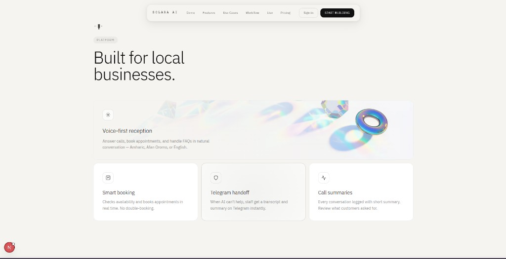
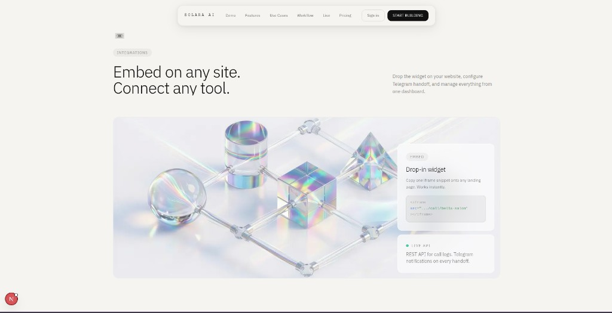
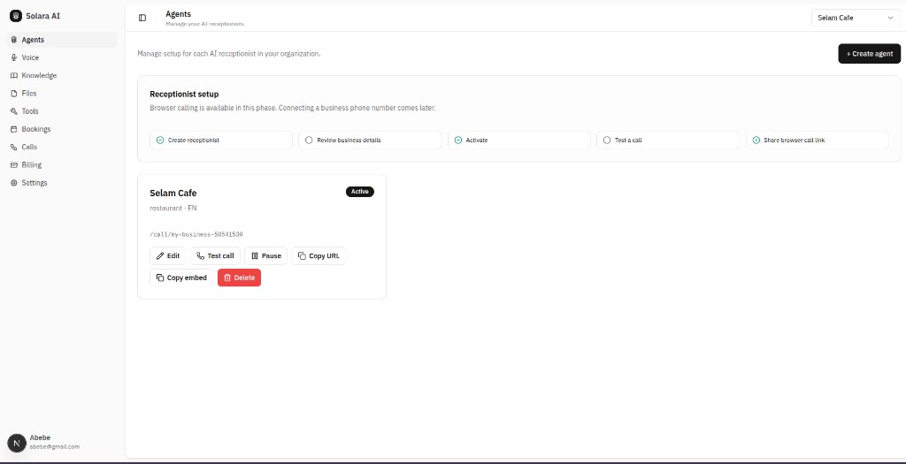
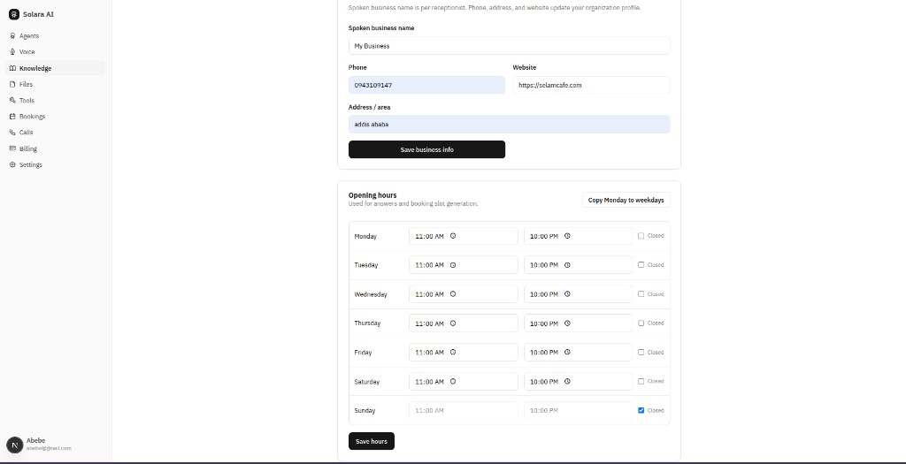
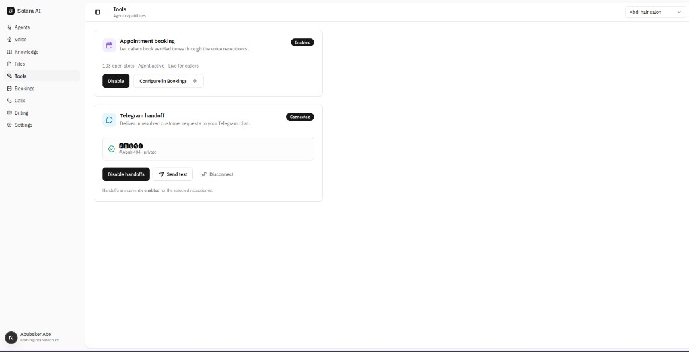
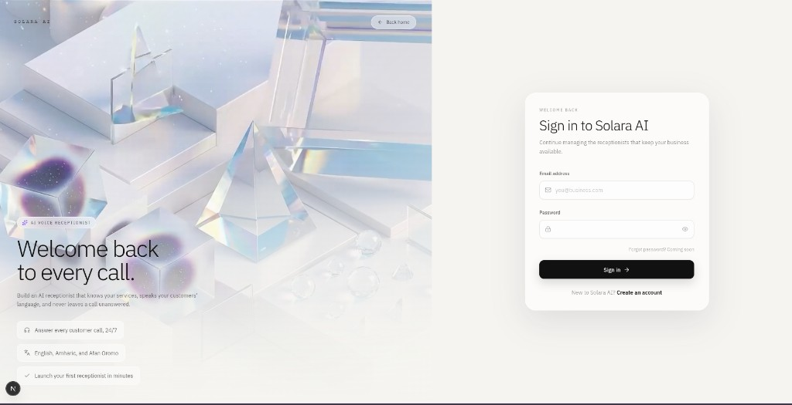

# Solara AI

AI voice receptionist for Ethiopian SMBs. Answer customer calls in Amharic, Afan Oromo, or English — handle FAQs, book appointments, and hand off to staff on Telegram when needed.

## Screenshots

### Landing page







### Dashboard







### Authentication



## Features

- **Voice-first reception** — Natural conversation over browser calls; no phone number required for testing
- **Multilingual** — English, Amharic, and Afan Oromo
- **Smart booking** — Real-time availability checks and appointment creation
- **Telegram handoff** — Unresolved requests sent to staff with transcript and summary
- **Knowledge base** — Business info, opening hours, FAQs, and file uploads
- **Drop-in embed** — Copy an iframe snippet onto any website
- **Call logs** — Every conversation logged with a short summary

## Tech stack

| Layer | Technology |
|-------|------------|
| Web | Next.js, React, Tailwind CSS |
| API | Express, tRPC |
| Database | PostgreSQL, Drizzle ORM |
| Auth | Better-Auth |
| Voice | LiveKit Agents, Gemini |

## Getting started

Install dependencies:

```bash
pnpm install
```

### Database setup

1. Create a PostgreSQL database.
2. Copy `.env.example` to `apps/server/.env` and fill in your connection details.
3. Push the schema:

```bash
pnpm run db:push
```

4. (Optional) Seed the Bella Salon demo:

```bash
pnpm run db:seed
```

- Email: `demo@bellasalon.com`
- Password: `BellaDemo2026!`
- Public call: [http://localhost:3001/call/bella-receptionist-en](http://localhost:3001/call/bella-receptionist-en)
- Embed demo: [http://localhost:3001/embed-demo.html](http://localhost:3001/embed-demo.html)

### Run locally

Start the API and web app:

```bash
pnpm run dev
```

Start the voice agent (separate terminal):

```bash
pnpm run dev:agent
```

- API: [http://localhost:3000](http://localhost:3000)
- Web: [http://localhost:3001](http://localhost:3001)

## Project structure

```
solar-ai/
├── apps/
│   ├── server/       # Express API (tRPC, internal routes, webhooks)
│   ├── web/          # Next.js dashboard and public call/embed pages
│   └── voice-agent/  # LiveKit voice agent worker
├── packages/
│   ├── api/          # tRPC routers and business logic
│   ├── auth/         # Better-Auth configuration
│   ├── db/           # Drizzle schema and migrations
│   └── env/          # Zod-validated environment variables
└── docs/
    └── screenshots/  # README screenshots
```

## Available scripts

| Script | Description |
|--------|-------------|
| `pnpm run dev` | Start API and web in development mode |
| `pnpm run dev:server` | Start only the API server |
| `pnpm run dev:web` | Start only the web app |
| `pnpm run dev:agent` | Start the LiveKit voice agent |
| `pnpm run build` | Build all applications |
| `pnpm run check-types` | Type-check across the monorepo |
| `pnpm run db:push` | Push schema changes to the database |
| `pnpm run db:seed` | Seed Bella Salon demo data |
| `pnpm run db:studio` | Open Drizzle Studio |
| `pnpm run docker:up` | Build and start Docker Compose stack |

## Deployment

### Docker Compose

```bash
pnpm run docker:build   # build images
pnpm run docker:up      # start stack
pnpm run docker:logs    # tail logs
pnpm run docker:down    # stop stack
```

Environment variables are read from each app's `.env` file and overridden in `docker-compose.yml` for container networking.

## License

Private — Solara Labs.
